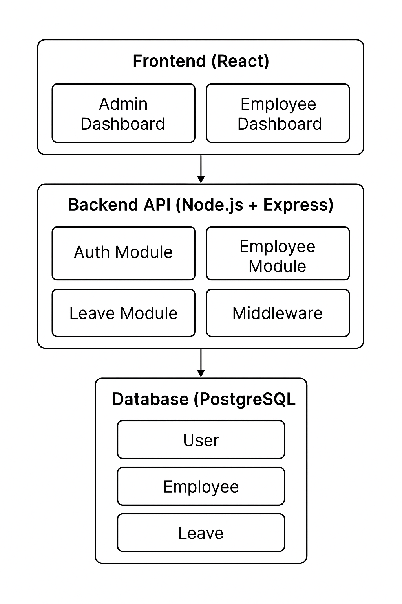

# Leave Management System

A comprehensive web application designed to streamline the leave management process for organizations. It enables employees to submit leave requests, while administrators can efficiently manage and approve them.

---

## Problem Statement & Objective

Build an MVP Leave Management System for a startup with 50 employees. The HR team should be able to:

- Add employees with details (Name, Email, Department, Joining Date).
- Apply, approve, and reject leave requests.
- Track leave balance for each employee.

---

## Edge Cases Handled

- Applying for leave before joining date is disallowed.
- Applying for more leave days than available balance is rejected.
- Overlapping leave requests by the same employee are prevented.
- Operations on non-existent employees return appropriate errors.
- Invalid date inputs (e.g., end date before start date) are validated.
- Leave cannot be applied for past dates.
- Concurrent approval requests are handled safely to avoid inconsistencies.

---

## Assumptions

- Each employee has a fixed annual leave quota reset yearly.
- Leave types (Paid, Sick, Casual) are predefined but extensible.
- Only Admin/HR can approve or reject leave requests.
- Leave balance is decremented only upon approval.
- Authentication via JWT with token expiry of 24 hours.
- Partial day leaves are not handled in MVP.
- Employees can view their leave balance and history.

---

## High-Level System Design

- **Frontend**: React-based SPA with separate Admin and Employee views.
- **Backend**: REST API built with Node.js and Express handling all business logic and validations.
- **Database**: MongoDB storing employees, leave requests, and user credentials.
- **API-DB Interaction**: APIs validate input, check constraints, update DB documents atomically.
- **Scaling**:
  - Initially handles 50 employees with a single server instance.
  - For scaling to 500+ employees, horizontal scaling via multiple stateless backend instances behind a load balancer.
  - Database optimizations like indexing, query optimization, and possible sharding.
  - Future microservices separation for user management and leave processing.

---

## Project Structure

The project is organized into two main directories:

- **client**: Contains the frontend application built with React.
- **server**: Hosts the backend API developed using Node.js and Express.

---

## Setup Instructions

### Prerequisites

- Node.js (v16 or higher)
- npm (v8 or higher)
- PastgreSql database (local or cloud)

### Installation Steps

1. **Clone the Repository**

   ```bash
   git clone https://github.com/HeatBlastee/Leave-Management-System.git
   cd Leave-Management-System
   ```

2. **Set Up the Backend**

   - Navigate to the `server` directory:
     ```bash
     cd server
     ```

   - Install dependencies:
     ```bash
     npm install
     ```

   - Create a `.env` file and configure the following variables:
     ```
     PORT=5000
     DATABASE_URL=your_mongodb_connection_string
     JWT_SECRET=your_jwt_secret_key
     ```

   - Start the server:
     ```bash
     npm run dev
     ```

3. **Set Up the Frontend**

   - Navigate to the `client` directory:
     ```bash
     cd ../client
     ```

   - Install dependencies:
     ```bash
     npm install
     ```

   - Create a `.env` file and configure the following variable:
     ```
     VITE_BACKEND_URL=http://localhost:8000
     ```

   - Start the frontend:
     ```bash
     npm run dev
     ```

  4. **Credentials**
   - Admin:
    ```
    email: admin@email.com
    password: 123456
    ```

   - Employee:
    ```
    email: sunilkumar@gmail.com
    password: 123456
    ```
---

##  Features

- **Employee Module**:
  - User authentication and authorization using JWT.
  - Submit leave requests with dates and types.
  - View leave balance and history.

- **Admin Module**:
  - Manage employee records (add, update, delete).
  - View and manage leave requests.
  - Access admin-only stats and reports.

- **Authentication & Authorization**:
  - Secure endpoints using `requireAuth` middleware to verify JWT.
  - Role-based access control via `requireAdmin` middleware.

- **User Interface**:
  - Responsive design for seamless experience across devices.
  - Real-time status updates for leave requests.

---

## 🔌 API Endpoints

### Authentication (`/auth`)

- **POST** `/register-admin`: Register an admin (protected in production).
- **POST** `/create-employee`: Create an employee account (Admin only).
- **POST** `/login`: Authenticate user and receive JWT token.
- **GET** `/me`: Get logged-in user profile.

### Employees (`/employees`)

- **GET** `/`: Get all employees (Admin only).
- **GET** `/:id`: Get employee details by ID.
- **PUT** `/:id`: Update employee details (Admin only).
- **DELETE** `/:id`: Delete an employee (Admin only).

### Leaves (`/leaves`)

- **POST** `/`: Apply for leave (Authenticated users).
- **GET** `/`: Get leave requests (Admins get all, employees get own).
- **PUT** `/:id/status`: Update leave status (Admin only).

### Admin (`/api/admin`)

- **GET** `/stats`: Get admin stats (Admin only).

---

##  Security Considerations

- Admin registration route `/api/auth/register-admin` should be protected or disabled in production to prevent unauthorized admin creation.
- All protected routes require a valid JWT token.
- Role-based middleware ensures only authorized users can access sensitive endpoints.
- Use HTTPS in production deployments.
- Consider adding security middlewares like Helmet and rate limiting.

---

##  High-Level Design

### Class Diagram

Main entities:

- User (Admin or Employee)
- Employee Profile
- Leave Request with status (Pending, Approved, Rejected)



### Flow Diagram

- User registration/login → JWT issued.
- Employee applies for leave → Backend validates, checks balance and overlapping.
- Admin approves/rejects leave → Leave status updated, balance adjusted.
- Users can fetch their leave status and history.

---

## 🚧 Potential Improvements

- Role-based access control with finer granularity.
- Email notifications on leave application status changes.
- Calendar integration for leave visualization.
- Support partial day leaves and multiple leave types.
- Two-factor authentication for enhanced security.

---

## 🌐 Live Demo

- **API Server**: https://leave-manager-server.onrender.com
- **Frontend Application**: https://leavemanager-n3sg.onrender.com

---

## 📄 License

This project is licensed under the MIT License - see the [LICENSE](https://github.com/HeatBlastee/Leave-Management-System/blob/main/LICENSE) file for details.

---

## 📸 Screenshots

**Employee Dashboard**


**Admin Dashboard**


**Leave Request Form**


**Admin Leave**


---

For detailed documentation and code walkthrough, please refer to the [GitHub repository](https://github.com/HeatBlastee/Leave-Management-System).

